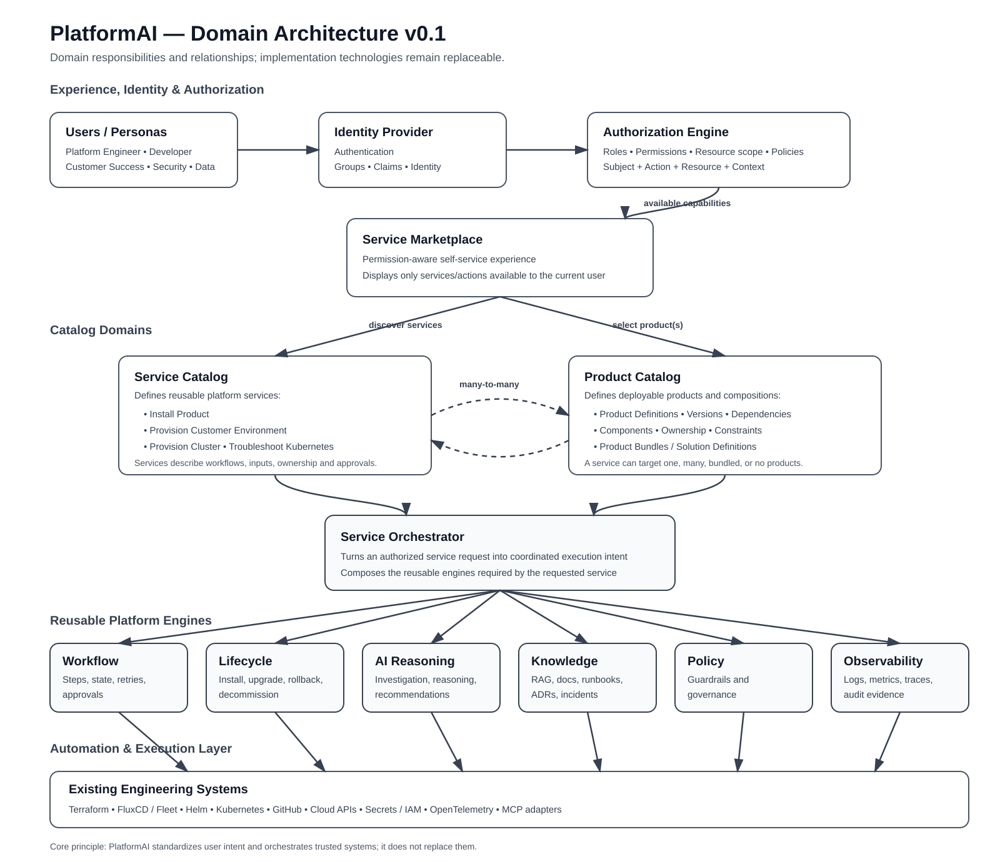

# PlatformAI Domain Architecture

## Purpose

This document describes the initial domain architecture of PlatformAI.

The goal is to define the major platform domains, their responsibilities, and the relationships between them before making implementation-specific decisions.

This architecture is intentionally technology-agnostic at the domain level. Technologies such as Kubernetes, Terraform, FluxCD, Helm, MCP, RAG, and LLM frameworks are implementation mechanisms that support the domains described here.

This document represents **Domain Architecture v0.1** and is expected to evolve as PlatformAI capabilities mature.

---

## Architectural Context

PlatformAI is an AI-enhanced Internal Developer Platform designed to provide a unified platform experience across existing engineering tools and workflows.

The platform separates user experience, identity and authorization, catalogs, orchestration, reusable platform engines, and execution systems.

A core architectural principle is:

> **PlatformAI augments and orchestrates existing engineering capabilities rather than replacing them.**

Users interact with platform services rather than directly interacting with the underlying infrastructure tools required to fulfill those services.

---

## Domain Architecture Diagram



---

## Domain Model

The PlatformAI domain model is organized into the following areas:

1. Identity
2. Authorization
3. Service Marketplace
4. Service Catalog
5. Product Catalog
6. Service Orchestration
7. Platform Engines
8. Automation and Execution

These domains have separate responsibilities and interact through well-defined boundaries.

---

## Identity Domain

### Responsibility

The Identity domain determines who is interacting with PlatformAI.

PlatformAI delegates authentication to an enterprise Identity Provider rather than implementing its own identity system.

Identity information may include:

- User identity
- Groups
- Claims
- Organizational attributes

### Example

An organization may authenticate users through Okta using OIDC.

PlatformAI consumes the resulting identity claims but does not manage user passwords.

### Boundary

Identity answers:

> **Who are you?**

It does not determine what the user is allowed to do.

Authorization is handled separately.

---

## Authorization Domain

### Responsibility

The Authorization domain determines which actions a user is permitted to perform against platform resources.

Authorization may consider:

- Identity groups
- Roles
- Permissions
- Resource scope
- Product
- Service
- Environment
- Organizational policies

### Personas Are Not Roles

PlatformAI personas describe user archetypes and their goals.

They are not authorization roles.

A Software Developer persona, for example, may map to several roles with different permissions.

One developer may only be allowed to view deployments while another may be able to deploy a specific application into a development environment.

### Authorization Model

The conceptual authorization request is:

```text
Subject + Action + Resource + Context
```

For example:

```text
Developer A
    +
Deploy
    +
Product A
    +
Development Environment
```

The same user may not be authorized to deploy the same product to production.

### Boundary

Authorization determines capabilities.

The user interface does not provide security enforcement itself.

Backend services must enforce the same authorization decisions.

---

## Service Marketplace

### Responsibility

The Service Marketplace is the self-service experience through which users discover and consume PlatformAI services.

The Marketplace is permission-aware.

It displays only the services and actions that are available to the authenticated user.

Examples may include:

- Provision Customer Environment
- Install Product
- Provision Kubernetes Cluster
- Request Database
- Troubleshoot Kubernetes
- Create Namespace
- Request Certificate

### Boundary

The Marketplace does not own authorization rules.

It receives the capabilities available to the user and renders the corresponding platform experience.

The Marketplace also does not execute services directly.

Execution is delegated to the Service Orchestrator.

---

## Service Catalog

### Responsibility

The Service Catalog defines the reusable services provided by PlatformAI.

A service represents a user-facing platform operation or workflow.

Examples:

- Install Product
- Provision Customer Environment
- Provision Cluster
- Troubleshoot Kubernetes
- Request Database
- Rotate Secret

A Service Definition may describe:

- Service name
- Description
- Required inputs
- Supported targets
- Approval requirements
- Owning team
- Applicable policies
- Workflow reference

### Services Are Reusable

Services should not be defined separately for every product.

For example, PlatformAI should define:

```text
Install Product
```

rather than:

```text
Install Product A
Install Product B
Install Product C
```

The product becomes an input to the reusable service.

---

## Product Catalog

### Responsibility

The Product Catalog defines the deployable products that PlatformAI can operate on.

A product represents a business application or solution that may consist of several deployable components.

A Product Definition may include:

- Product metadata
- Versions
- Components
- Helm charts
- Configuration
- Dependencies
- Infrastructure requirements
- Ownership
- Deployment constraints

For example:

```text
Product A
├── Frontend
├── API
├── Workers
├── Database dependencies
└── Supporting services
```

### Product Bundles

The Product Catalog may also support Product Bundles.

A Product Bundle groups multiple products into a reusable solution definition.

For example:

```text
Enterprise Suite
├── Core Product
├── Identity Product
├── Analytics Product
└── Observability Add-on
```

This enables higher-level services to operate on complete solutions without requiring users to select every component individually.

---

## Service and Product Relationship

Services and products do not have a one-to-one relationship.

The relationship is intentionally reusable and may be many-to-many.

A service may operate on:

- No product
- One product
- Multiple products
- A product bundle

Likewise, the same product may be consumed by multiple services.

Examples:

```text
Install Product
    → Product A
    → Product B
    → Product C
```

and:

```text
Provision Customer Environment
    → Product A
    → Product B
    → Observability Add-on
```

This separation allows PlatformAI to standardize workflows while keeping product definitions reusable.

> **Standardize the workflow; parameterize what it operates on.**

---

## Service Orchestration Domain

### Responsibility

The Service Orchestrator coordinates the execution of requested platform services.

It receives an authorized service request and determines which platform engines and external systems are required to fulfill it.

A typical request may contain:

- Requested service
- User identity
- Authorized capabilities
- Selected product or products
- Target environment
- Configuration
- Approval state

### Example

A request to provision a customer environment may coordinate:

1. Authorization validation
2. Policy evaluation
3. Infrastructure provisioning
4. Product lifecycle operations
5. GitOps changes
6. Deployment validation
7. Observability
8. Audit recording

### Boundary

The Service Orchestrator coordinates execution.

It should not reimplement Terraform, GitOps, Kubernetes, identity, or observability functionality.

---

## Platform Engines

Platform Engines are reusable internal capabilities used by one or more services.

Users do not interact with engines directly.

Services compose engines to fulfill user requests.

### Workflow Engine

Coordinates multi-step workflows, approvals, retries, and state transitions.

### Product Lifecycle Engine

Manages product lifecycle operations such as:

- Install
- Upgrade
- Rollback
- Decommission
- Validation

### AI Reasoning Engine

Provides AI-assisted reasoning, recommendations, investigation, and agent behavior.

### Knowledge Engine

Provides retrieval of platform knowledge such as:

- Documentation
- Runbooks
- Architecture Decision Records
- Previous incidents
- Product documentation

RAG may be used as an implementation technique for this domain.

### Policy Engine

Evaluates organizational and platform policies before actions are performed.

### Observability Engine

Provides visibility into PlatformAI workflows and platform operations through:

- Logs
- Metrics
- Traces
- Audit information

### Authorization Engine

Evaluates permissions and resource access.

Although authorization participates in service execution, it remains a distinct security domain and is invoked whenever protected capabilities are accessed.

---

## Automation and Execution Layer

PlatformAI does not replace existing engineering tools.

Platform engines and orchestration workflows use existing systems to execute changes.

Examples include:

- Terraform for infrastructure provisioning
- FluxCD or Fleet for GitOps reconciliation
- Helm for application packaging
- Kubernetes APIs for runtime operations
- GitHub for repositories, pull requests, and CI/CD workflows
- Cloud APIs for cloud infrastructure
- Secret management systems for credentials and secrets
- OpenTelemetry-compatible systems for telemetry
- MCP servers or adapters for standardized AI tool access

The exact technologies may evolve without changing the responsibility of the domains above.

---

## High-Level Request Flow

A typical PlatformAI interaction follows this flow:

```text
User
  ↓
Enterprise Identity Provider
  ↓
Authorization
  ↓
Service Marketplace
  ↓
Service Catalog
  ↓
Selected Product(s) / Product Bundle
  ↓
Service Orchestrator
  ↓
Platform Engines
  ↓
Existing Engineering Tools
  ↓
Infrastructure / Runtime
```

The result and telemetry flow back through the platform so the user can observe the outcome of the request.

---

## Example: Provision Customer Environment

A Customer Success user requests:

```text
Provision Customer Environment
```

with:

```text
Customer: Example Corp
Environment: Production
Products:
- Core Product
- Analytics Product
Infrastructure: GCP
Region: Montreal
```

PlatformAI:

1. Authenticates the user through the enterprise identity provider.
2. Evaluates whether the user can request the service.
3. Validates the requested products and target environment.
4. Determines whether approval is required.
5. Invokes the Service Orchestrator.
6. Coordinates infrastructure provisioning through existing automation.
7. Invokes the Product Lifecycle Engine for selected products.
8. Produces GitOps desired state.
9. Allows the existing GitOps system to reconcile the environment.
10. Validates deployment health.
11. Emits logs, metrics, traces, and audit events.
12. Reports the provisioning result to the requester.

The user consumes a single platform service while PlatformAI coordinates several underlying systems.

---

## Architectural Boundaries

PlatformAI intentionally maintains the following separations:

```text
Persona ≠ Role
Identity ≠ Authorization
Product ≠ Service
Catalog ≠ Marketplace
Authorization ≠ User Interface
Service ≠ Engine
Orchestration ≠ Execution
AI Reasoning ≠ Infrastructure Access
```

These boundaries reduce coupling and allow individual platform domains to evolve independently.

---

## Relationship to Engineering Principles

This domain architecture reflects the existing PlatformAI engineering principles.

### Platform as a Product

Users consume platform services rather than infrastructure primitives.

### People Before Technology

Services are derived from persona needs and operational problems.

### Build on Existing Tooling

Execution remains delegated to established engineering systems.

### AI Augments Engineers

AI assists workflows without replacing engineering accountability.

### Evidence Before Action

Operational workflows gather evidence before recommendations or changes.

### Human Approval for Risky Operations

High-impact operations can require explicit approval.

### Secure by Design

Identity, authorization, policy, and auditability are first-class domains.

### Observable by Design

Platform workflows produce telemetry and audit information.

### Incremental Evolution

The architecture can evolve domain by domain.

### Separation of Concerns

Each domain has a clear responsibility and boundary.

---

## Evolution

This document represents the initial PlatformAI domain architecture.

Future revisions may introduce or refine:

- Resource-scoped authorization
- Attribute- or policy-based access control
- Service and Product Definition schemas
- Product Bundles
- Workflow definitions
- Approval models
- Platform APIs
- Event-driven communication
- Multi-cluster and multi-cloud abstractions
- Agent orchestration
- MCP integration
- RAG architecture
- Platform tenancy boundaries

Significant architectural changes should be captured through Architecture Decision Records.

---

## Guiding Question

When adding or changing a domain, ask:

> **Does this responsibility belong here, and can this domain evolve without unnecessarily coupling itself to the others?**
